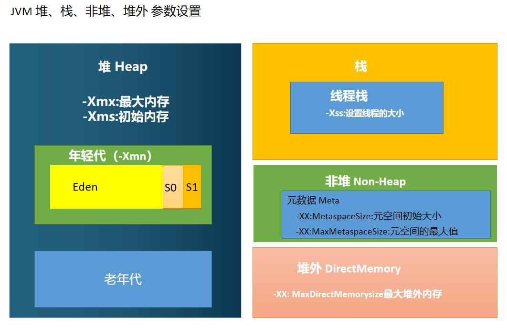

#学习笔记

## 第一课 JVM 基础

### 作业1、分析 HelloByteCode.class 字节码

源码
[HelloByteCode.java](src/homework1/HelloByteCode.java)

运行

```bash
#cd src
#编译 
javac homework1/HelloByteCode.java
#在反编译 class
javap -c  homework1/HelloByteCode.class
#在反编译 class 时，指定 ‐verbose 选项, 则会输出附加信息
javap -c -verbose homework1/HelloByteCode.class

#生成调试信息的 ‐g 参数吗
javac -g homework1/HelloByteCode.java
javap -c -verbose homework1/HelloByteCode.class
```


### 作业2、自定义一个 Classloader,加载一个 Hello.xlass 文件、执行 hello 方法，
此文件内容是一个Hello.xlass 文件所有字节(x=255-x)处理后的文件。

源码
[HelloClassLoader.java](src/homework2/HelloClassLoader.java)

运行
```bash
cd src/homework2

#编译
javac -classpath ".." HelloClassLoader.java 

#运行
java -classpath ".." homework2.HelloClassLoader

#结果
Hello, classLoader!

```

### 作业3、画一张图，展示 Xmx、Xms、Xmn、Meta、DirectMemory、Xss 这些内存参数的关系。

Xmx : 堆的最大可用内存大小<br/>
Xms：堆的初始内存大小<br/>
Xmn：年轻代大小<br/>
-XX:MetaspaceSize:元空间初始大小<br/>
-XX:MaxMetaspaceSize:元空间的最大值<br/>
-XX: MaxDirectMemorysize最大堆外内存<br/>




### 作业4、检查一下自己维护的业务系统的 JVM 参数配置，用 jstat 和 jstack、jmap 查看一下详情，并且自己独立分析一下大概情况，思考有没有不合理的地方，如何改进。
